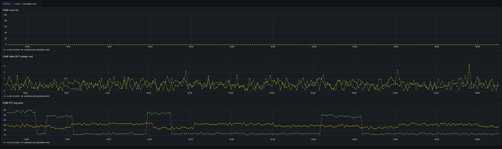
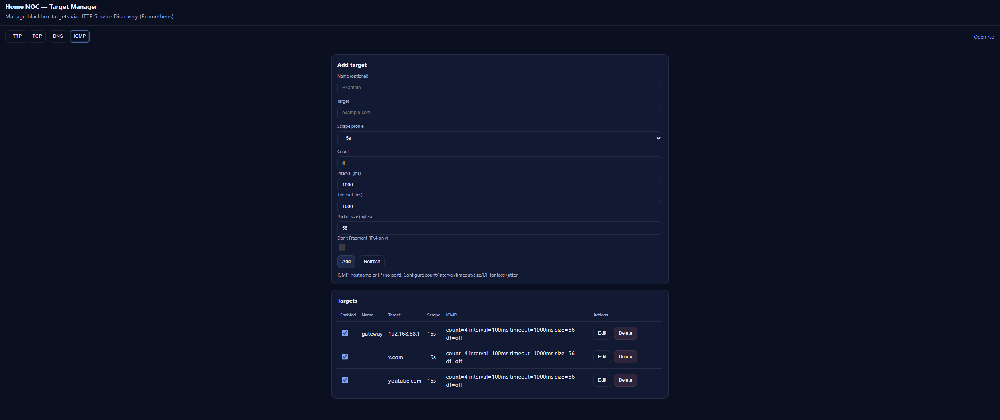

# Home NOC

Небольшой self-hosted мониторинг доступности сети из домашней точки: DNS / TCP / HTTP + ICMP.



## Компоненты

- `probe/` - домашние пробы:
  - `prom/blackbox-exporter` (HTTP/TCP/DNS)
  - `icmp-prober` (loss/jitter, конфигурируемые профили)
- `core/` - центральный узел:
  - Prometheus
  - Grafana
  - Alertmanager
  - Target Manager (Web UI + REST API + HTTP SD)

## Порты

### Core (localhost)

- Prometheus: `127.0.0.1:9981`
- Alertmanager: `127.0.0.1:9982`
- Grafana: `127.0.0.1:9983`
- Target Manager: `127.0.0.1:9984`

### Probe (home, localhost)

- Blackbox exporter: `127.0.0.1:9115`
- ICMP prober: `127.0.0.1:9985`

### VPS reverse SSH endpoints (на VPS, localhost)

- Blackbox exporter (home): `127.0.0.1:19115`
- ICMP prober (home): `127.0.0.1:9985`

## Сценарии

- Local-only: `probe` + `core` на одной машине (Docker network `probe_default`).
- VPS Core + Home Probe: `core` на VPS (Linux, `network_mode: host`), `probe` подключается через reverse SSH.

## Quickstart: Local-only

1) Запуск `probe`:

```sh
cd probe
docker compose up -d --build
```

2) Запуск `core`:

```sh
cd core
docker compose -f compose.local.yml up -d --build
```

3) UI:

- Grafana: http://127.0.0.1:9983 (default: `admin` / `admin`)
- Prometheus: http://127.0.0.1:9981
- Alertmanager: http://127.0.0.1:9982
- Target Manager: http://127.0.0.1:9984

## Deploy: VPS Core + Home Probe

Требования:
- Docker Engine + Docker Compose plugin на VPS (Linux).
- Исходящий SSH с дома на VPS.

1) На VPS:

```sh
cd core
docker compose up -d --build
```

2) Дома: поднять `probe` и открыть reverse SSH (2 порта):

```sh
cd probe
docker compose up -d --build

ssh -N -R 127.0.0.1:19115:127.0.0.1:9115 -R 127.0.0.1:9985:127.0.0.1:9985 -o ServerAliveInterval=30 -o ServerAliveCountMax=3 user@vps
```

3) Доступ к UI core через SSH port-forward (на локальной машине):

```sh
ssh -L 9983:127.0.0.1:9983 -L 9981:127.0.0.1:9981 -L 9982:127.0.0.1:9982 -L 9984:127.0.0.1:9984 user@vps
```

## Таргеты (Target Manager)

Источник таргетов - Target Manager (HTTP Service Discovery). Prometheus получает цели с `/sd/*`.

- UI: http://127.0.0.1:9984
- API: `GET/POST/PATCH/DELETE /api/targets`
- SD: `/sd/http`, `/sd/tcp`, `/sd/dns`, `/sd/icmp`

Scrape profiles: `1s` / `5s` / `15s` (default) / `60s`. Значение хранится на цели и применяется через HTTP SD (`refresh_interval` = 30s).



